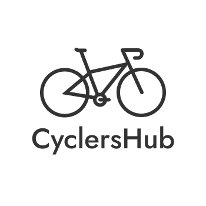

[![Contributors][contributors-shield]][contributors-url]
[![Forks][forks-shield]][forks-url]
[![Stargazers][stars-shield]][stars-url]
[![Issues][issues-shield]][issues-url]
[![MIT License][license-shield]][license-url]
[![LinkedIn][linkedin-shield]][linkedin-url]

 

  

<h3 align="center">The CyclersHub</h3>

  

    The CyclersHub is the perfect online community to connect with like-minded individuals and plan your next cycling adventure.
     
    <a href="https://docs.cyclershub.com"><strong>Explore the docs »</strong></a>
     
     
    <a href="https://cyclershub.com">Website</a>
    ·
    <a href="https://github.com/cyclershub/cyclershub/issues">Report Bug</a>
    ·
    <a href="https://github.com/cyclershub/cyclershub/issues">Request Feature</a>
  

## About The Project

Welcome to The CyclersHub, the ultimate online destination for those who believe that the best way to see the world is on two wheels (and, you know, with a few snacks and a cozy sleeping bag).

Whether you're a hardcore cycling enthusiast or just starting out on your journey to greatness, The CyclersHub is the perfect community to help you pedal your way to adventure. With features like a camping place search function, a forum for sharing tips and advice, and much more, you'll have everything you need to plan your next epic cycling expedition (just don't forget the sunscreen).

So strap on your helmet, hop on your bike, and let's go explore the world together (virtually, of course - we're not responsible for any injuries if you try to cycle through your computer screen). Who knows, you might just meet your new cycling soulmate (or at least find a new biking buddy to share your snack stash with).

So what are you waiting for? Get ready to cycle your way to glory and discover all the resources and tools available on The CyclersHub. We promise it'll be wheelie great (sorry, we couldn't resist).

> **Warning**
> [The CyclersHub](https://cyclershub.com) is still very much in an "Open Alpha" state. If you encounter any errors whilst "test-driving" it, please don't hesitate to contact [@Letsmoe](https://github.com/Letsmoe) or [open a new issue](https://github.com/cyclershub/cyclershub/issues). Thank you!

## Getting Started

Welcome to The Cyclershub, the website that'll have you spinning with joy!

To get started with this project and become the ultimate cycling aficionado, just follow these easy-peasy steps:

1. Sit back, relax, and get ready to take a ride on the wild side - just kidding, no bike required! All you need to do is head on over to our website at [https://cyclershub.com](https://cyclershub.com).

2. Once you're there, take a moment to soak it all in. Check out our awesome resources, connect with other cycling enthusiasts, and get tips on how to keep your bike running smoothly.

3. Feeling adventurous? Consider contributing to our project! Check out our GitHub repository and follow the instructions for contributing. You might just pedal your way to fame and fortune (or at least a few high-fives from the team)!

4. If you have any questions or encounter any issues, our support team is always ready to help. And if all else fails, just remember - when in doubt, pedal it out!

Thanks for joining us at The Cyclershub. Now let's ride off into the sunset (or, you know, just close your laptop and go outside for a real bike ride).

## Roadmap

## Phase 1: Website Setup and Basic Features

- [x] Website Launch
- [x] Homepage Design and Layout
- [x] Basic Camping Spot Search
- [x] Forum Feature Implementation
- [x] User Account Creation and Login
- [ ] Basic User Profile Pages
- [x] Basic Navigation Menu

## Phase 2: Content Development and Advanced Features

- [ ] Tracks Feature Implementation
- [ ] Stories (Blog) Feature Implementation
- [ ] Tutorials Feature Implementation
- [ ] Buyers Advice Feature Implementation
- [ ] User Commenting System for Forum, Stories, and Tutorials
- [ ] Advanced Search Functionality for Camping Spots, Tracks, and Stories
- [ ] Social Media Integration for Sharing Content
- [ ] User Preferences and Customization Options
- [ ] CyclersHub MeetUp
  - [ ] Submitting a User's Position
  - [ ] Finding Users depending on location
  - [ ] Chat Integration (WhatsApp/Discord)

## Phase 3: Optimization and Expansion

- [ ] Mobile Optimization and Responsive Design
- [ ] Translation to Multiple Languages
- [ ] Community Building and Outreach
- [ ] User Feedback System for Continuous Improvement

Note that this is just one possible roadmap based on the provided feature ideas, and it may change based on new ideas, feedback, and other factors. The important thing is to have a plan in place and to keep moving forward towards making The Cyclershub the ultimate resource for cycling enthusiasts.

See the [open issues](https://github.com/cyclershub/cyclershub/issues) for a full list of proposed features (and known issues).

## Contributing

Here at The Cyclershub, we believe that cycling is better when we all work together. That's why we appreciate your contributions more than we appreciate a good tailwind on a steep climb.

If you've got an idea that'll make our website even better (or just want to show off your amazing coding skills), we welcome you to fork our repo and create a pull request. Or, if you prefer a more low-key approach, just open an issue with the tag "enhancement". Either way, we're always eager to hear from fellow cyclists and coding wizards alike.

Oh, and don't forget to give our project a star if you think it's as cool as we do. We promise it won't go to our heads (okay, maybe just a little).

Here's how to get started with contributing to The Cyclershub:

1. Fork the Project (it's not as scary as it sounds, we promise)
2. Create your own feature branch and give it a catchy name, like `feature/AmazingFeature`
3. Commit your Changes (bonus points if you write a funny commit message)
4. Push to the Branch (you're on a roll now!)
5. Open a Pull Request and wait for the cheers and applause to roll in.

Thanks for considering contributing to our project. We couldn't do it without you (seriously, we've tried). Happy coding and cycling!

## License

Distributed under the MIT License. See `LICENSE` for more information.

## Contact

Moritz Utcke - [@Letsmoe](https://github.com/Letsmoe)

Project Link: [https://github.com/cyclershub/cyclershub](https://github.com/cyclershub/cyclershub)

[contributors-shield]: https://img.shields.io/github/contributors/cyclershub/cyclershub.svg?style=for-the-badge
[contributors-url]: https://github.com/cyclershub/cyclershub/graphs/contributors
[forks-shield]: https://img.shields.io/github/forks/cyclershub/cyclershub.svg?style=for-the-badge
[forks-url]: https://github.com/cyclershub/cyclershub/network/members
[stars-shield]: https://img.shields.io/github/stars/cyclershub/cyclershub.svg?style=for-the-badge
[stars-url]: https://github.com/cyclershub/cyclershub/stargazers
[issues-shield]: https://img.shields.io/github/issues/cyclershub/cyclershub.svg?style=for-the-badge
[issues-url]: https://github.com/cyclershub/cyclershub/issues
[license-shield]: https://img.shields.io/github/license/cyclershub/cyclershub.svg?style=for-the-badge
[license-url]: https://github.com/cyclershub/cyclershub/blob/master/LICENSE.txt
[linkedin-shield]: https://img.shields.io/badge/-LinkedIn-black.svg?style=for-the-badge&logo=linkedin&colorB=555
[linkedin-url]: https://linkedin.com/in/moritz-utcke-5677a3184
